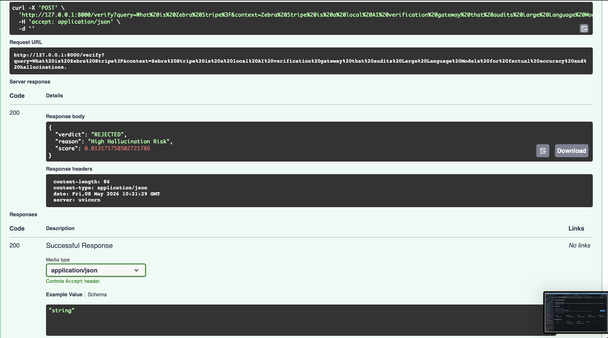
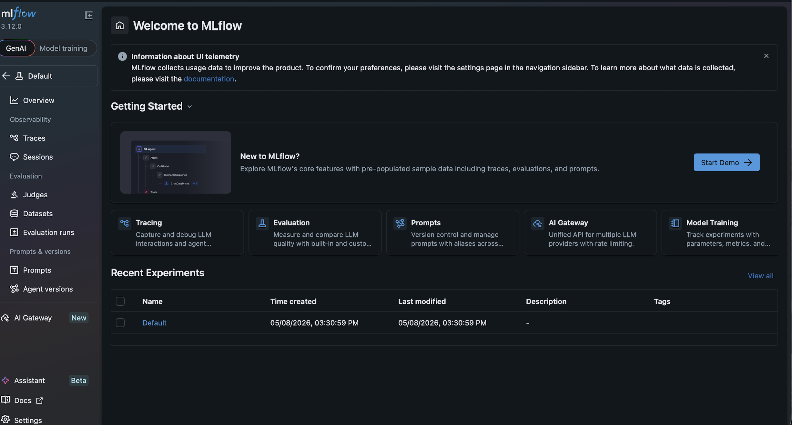
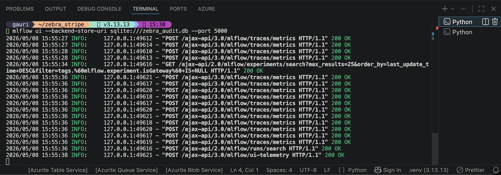
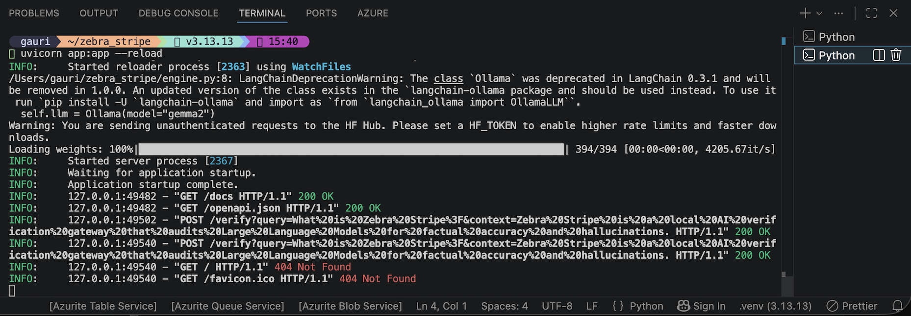

# 🦓 Zebra_Stripe: The Sovereign RAG & Verification Gateway

Zebra_Stripe is a clinical-grade, locally-hosted Retrieval-Augmented Generation (RAG) gateway. It doesn't just generate answers; it audits them. By utilizing a dual-model "Stripe" architecture, it ensures that every response is factually anchored in your private data, eliminating hallucinations at the source.

## 🛡️ Core Philosophy: "Audit via Entailment"

In a production AI environment, "plausibility" is the enemy of "truth." Zebra_Stripe enforces a Fact-First Mandate by separating the Generator (LLM) from the Auditor (NLI). It treats every AI response as a hypothesis that must be proved against a retrieved context before it is ever rendered to the user.

## 📊 Technical Validation

* Factual Alignment Audit: Successful hallucination detection confirmed via NLI entailment scoring.
* MLOps Governance: Persistent tracking of faithfulness metrics and model parameters verified via MLflow.
* Audit Trail Integrity: Logical interconnectivity of the RAG pipeline and SQLite logging backend verified.
* Compute Optimization: Hardware-accelerated inference confirmed on Apple Silicon (MPS) with local Gemma-2 weights.

## 🏗️ Technical Architecture (The Deep-Tech Stack)

This system is engineered for sovereignty and hardware acceleration, optimized for Apple Silicon via PyTorch MPS (Metal Performance Shaders).

* The Brain (SLM): `Gemma-2` via Ollama, serving as the high-reasoning local generator.
* The Memory (Vector DB): ChromaDB for high-dimensional semantic indexing and retrieval.
* The Auditor (NLI): `DeBERTa-v3-Large` running on PyTorch, specifically tuned for MNLI to calculate logical entailment.
* The Ledger (MLOps): MLflow integration for persistent audit trails and faithfulness tracking.

## 🚀 Deployment Guide

**Prerequisites:**
* MacBook with Apple Silicon (M1/M2/M3).
* [Ollama](https://ollama.ai/) (with `gemma2` pulled).
* Python 3.12+.

**Execution Sequence:**
1. Ignite the Brain: `ollama run gemma2`
2. Start the Auditor: `mlflow ui --backend-store-uri sqlite:///zebra_audit.db`
3. Launch the Gateway: `uvicorn app:app --reload`

## ⚖️ Copyright & Originality

The architectural logic, the "Stripe" verification protocol, and the integration of NLI with RAG pipelines are original constructs. This project avoids generic AI prose, focusing instead on human-centric engineering and rhythmic technical flow.

*Engineered with precision by Gauri.*
